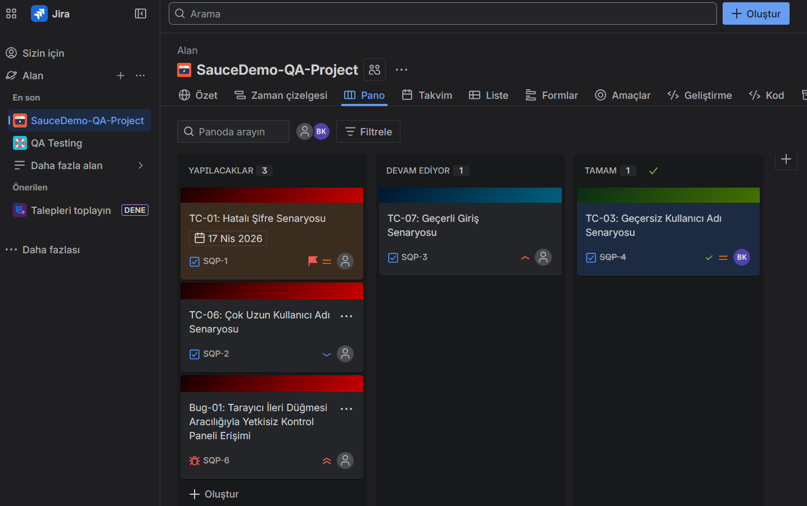

# SauceDemo-Manual-Testing & QA Portfolio
Bu proje, bir e-ticaret simülasyonu olan SauceDemo platformu üzerinde gerçekleştirilen uçtan uca manuel test süreçlerini kapsar. Projenin amacı, sadece hataları bulmak değil; bir yazılımın güvenlik, kullanılabilirlik ve iş mantığı (business logic) çerçevesinde kalitesini doğrulamaktır.

### 📊 Test Senaryoları Özeti (Quick Look)

| ID | Test Başlığı | Öncelik | Tip | Durum |
| :--- | :--- | :--- | :--- | :--- |
| **TC-01** | Hatalı Şifre ile Login Denemesi | High | Negatif | ✅ PASSED |
| **TC-02** | Boş Kullanıcı Adı ile Login | High | Negatif | ✅ PASSED |
| **TC-03** | Geçerli Bilgilerle Başarılı Giriş | Critical | Pozitif | ✅ PASSED |
| **TC-04** | Sınır Değer (Çok Uzun Karakter) Testi | Medium | Pozitif | ✅ PASSED |
| **TC-05** | Tarayıcı Navigasyon Güvenliği | Critical | Güvenlik | ❌ **FAILED (BUG)** |

# Detaylı Test Senaryoları & Adımlar
Tabloda belirtilen testlerin detaylı adımlarını incelemek isterseniz:

# Tespit Edilen Kritik Hatalar (Bug Reports)
BUG-01: Yetkisiz Erişim (Browser Navigation Bypass)
Önem Derecesi: Kritik (Critical)

Özet: Kullanıcı, giriş yaptıktan sonra tarayıcı geri-ileri butonlarını kullanarak şifre sormadan panele tekrar erişebiliyor.

Yeniden Oluşturma Adımları:

Sisteme başarılı giriş yapın.

Tarayıcıdan "Geri" butonuna basın.

Ardından "İleri" butonuna basın.

Gerçekleşen Sonuç: Sayfa, kullanıcı bilgilerini istemeden ürünler sayfasına yönleniyor.

Beklenen Sonuç: Oturum kontrolü yapılmalı ve kullanıcı tekrar login sayfasına yönlendirilmelidir.

# Proje Yönetimi ve Hata Takibi (Jira)

Bu projedeki test süreçleri ve hata döngüsü, endüstri standardı olan Jira üzerinden profesyonel bir iş akışı ile yönetilmiştir.

📋 Kanban İş Akışı

Tüm test senaryoları ve tespit edilen hatalar, durumlarına göre (Yapılacaklar, Devam Ediyor, Tamam) anlık olarak takip edilmiştir. Kritik senaryolar önceliklendirilerek (High/Highest Priority) test planına dahil edilmiştir.

Görsel 1: Test süreçlerinin ve önceliklendirmelerin Jira Pano üzerindeki genel görünümü.

🐞 Detaylı Hata Raporlama (Bug Reporting)

Tespit edilen Bug-01 (Yetkisiz Erişim) hatası, yazılım ekibinin hatayı en hızlı şekilde anlayıp düzeltebileceği standartlarda dökümante edilmiştir. Rapor; Yeniden Oluşturma Adımları, Beklenen Sonuç ve Gerçekleşen Sonuç gibi kritik teknik detayları içermektedir.

Görsel 2: Tespit edilen kritik güvenlik açığının Jira üzerindeki detaylı hata kaydı.

*Görsel 1: Test süreçlerinin Kanban Board üzerinde yönetimi.*

*Görsel 2: Tespit edilen kritik hatanın Jira üzerindeki detaylı raporu.*

# ✨ Kullanılabilirlik ve Arayüz (UI/UX) Değerlendirmesi
Manuel test süreçlerinde, uygulamanın sadece teknik olarak çalışması değil, kullanıcı için ne kadar erişilebilir ve anlaşılır olduğu da aşağıdaki kriterler çerçevesinde analiz edilmelidir:

 İşletilebilirlik ve Gezinme: Sayfa geçişleri akıcı mı? Menü ve buton yerleşimleri kullanıcının hedefine en kısa yoldan ulaşmasını sağlıyor mu?

 Erişilebilirlik (Keyboard Navigation): Uygulama fare kullanmadan, sadece klavye (Tab, Enter) ile kontrol edilebiliyor mu?

 Responsive Tasarım: Farklı ekran çözünürlüklerinde (Mobil, Tablet, Masaüstü) görsel bir bozulma yaşanıyor mu?

 Veri Giriş Kolaylığı: Giriş alanlarındaki Placeholder (yer tutucu) metinleri kullanıcıyı doğru şekilde yönlendiriyor mu?

 Hata Yönetimi Görünürlüğü: Yanlış işlemlerde çıkan hata mesajları okunaklı mı ve kullanıcıya çözüm sunuyor mu?

 Buton ve Etkileşim Netliği: Tıklanabilir alanlar (Login, Menü vb.) net bir şekilde ayırt edilebiliyor mu?
